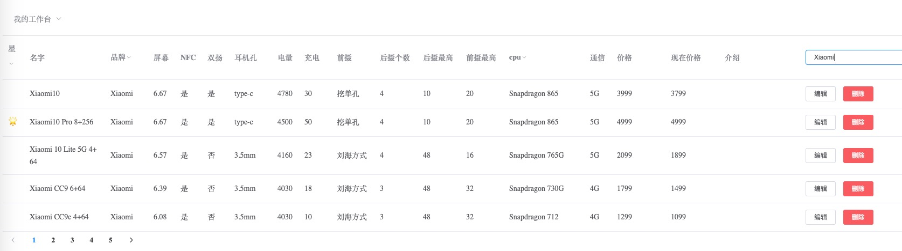

<div align="center">
<h1>📱Phones</h1>
  
  
  
</div>


[ English | [中文](./README-CN.md) ]

## 🤔 What I can do

- list Phone with its feature

- you can choose a suitable phone by filter

- Integrated recommend video,discount,link

- more products recommend not only phones (maybe)

  


## 🌞 Environment

List main language and their versions，for more -->[package.json](./package.json)

```
- node v12.16.2
- eggjs v2.15.1
- egg-mysql: 3.0.0
- egg-sequelize: 5.2.2
- vue: 2.6.11
- vue-server-renderer: 2.6.11
- element-ui: 2.13.0
- egg-jwt 
- axios
- eslint
```


## 🌲 Directory Structure

Use Eggjs

```
egg-project
├── package.json
├── app
|   ├── router.js
│   ├── controller
│   |   └── home.js
│   ├── service
│   ├── schedule
│   |   └── updatePrice.js
│   ├── public 
│   └── extend 
├── config
|   ├── plugin.js
|   ├── config.default.js
├── phones_phones.sql
```


## 🐼 Todo List

:hand: add check function when create new phones

:hand: add login pages to prevent attack

:hand: add more product to recommend ，such as dxo，earphone ,watch

:white_check_mark:  publish v0.1-welcome,and first images[2020-06-04@ShawnGoethe]

:white_check_mark:  have modify,delete function[2020-07-16@ShawnGoethe]

:white_check_mark:  input data，new search，add star recommend[2020-07-20@ShawnGoethe]

:white_check_mark:  add taobao update schedule,to update price. and filters[2020-07-28@ShawnGoethe]

:white_check_mark: add login pages to prevent attack && add  monitor select from [alinode](https://www.aliyun.com/product/nodejs?spm=a2c4g.11174283.2.1.70ae30b15SwgUh)[2020-08-12@ShawnGoethe]


# 🚩Show




## 😄 Welcome PR

wecome PR if I have

Main Language：Eggjs Sequelize VueSSR


## 🏠 Build

### 1.You can use git clone to run this project 

```shell
git clone https://github.com/ShawnGoethe/phones.git
npm install //cd phone folder
npm run dev
```

### 2. You can also build by docker

```sh
docker pull zhangzehai/phones:latest
docker run -itd --name phones -p 7001:7001 zhangzehai/phones:latest
```

Finally open the web and input `http://127.0.0.1:7001/phone`  and then enjoy it

`http://127.0.0.1:7001/` is a ramdom test 😺

### 3. Direct , u can visit my student VPS

```shell
http://phones.tbjd.xyz/
I will update if I remember (use docker images)
//nothing on it so Don't bother to hack
```


## 🚩About me

- Blog：[http://zehai.info](http://zehai.info/)
- Github：http://github.com/ShawnGoethe
- Contact：569326840@qq.com 
- 蓝桥杯国家奖，国家本科奖学金

  


## :link: Link

Standing on the shoulders of giants

- [Eggjs.org](https://github.com/eggjs/egg)

- [eggVueSpaTemplate](https://github.com/klren0312/eggVueSpaTemplate)